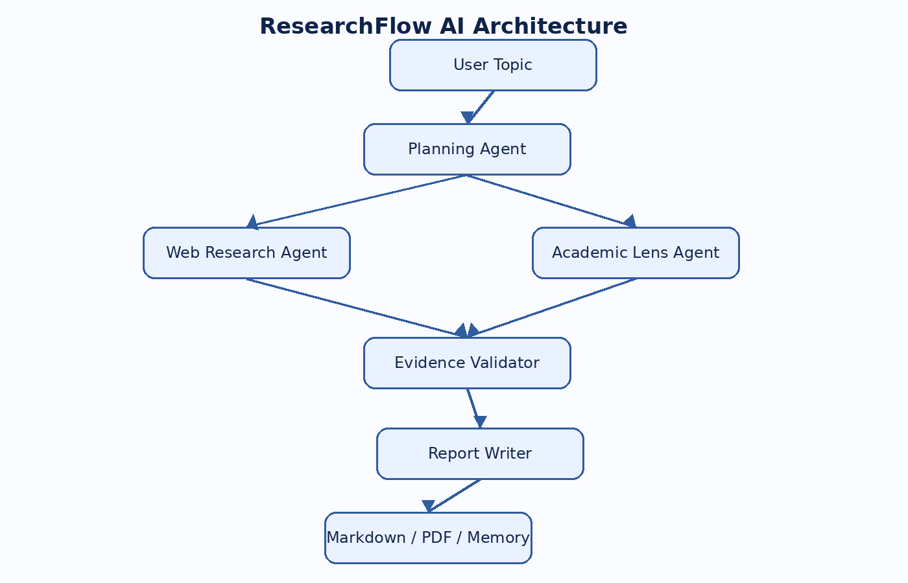
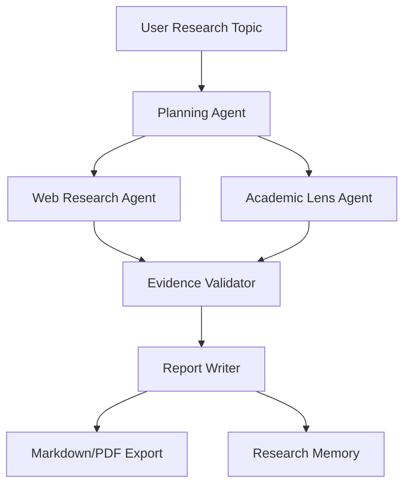

# ResearchFlow AI


ResearchFlow AI is a GitHub-ready, portfolio-focused multi-agent research platform built with **Python**, **Streamlit**, **OpenAI Agents SDK**, and **Pydantic**. It turns a research topic into a structured plan, gathers evidence, validates claims, and generates a downloadable Markdown/PDF research report.

> This project was designed as an original portfolio implementation, not a direct copy of a tutorial project. The architecture, naming, workflow, folder structure, validation layer, memory layer, exports, and UI are customized for GitHub showcasing.

---

## Features

- Multi-agent research workflow
- Planning Agent for research strategy
- Web Research Agent with evidence capture
- Academic Lens Agent for scholarly/technical context
- Evidence Validator for confidence scoring
- Report Writer for polished Markdown reports
- Streamlit dashboard with tabs for workflow, report, and sources
- Markdown and PDF exports
- Research memory stored as JSON for reproducibility
- CLI runner for terminal-based execution
- Mermaid workflow diagram for documentation

---

## Architecture





---

## Tech Stack

| Area | Tools |
|---|---|
| Language | Python |
| UI | Streamlit |
| AI Orchestration | OpenAI Agents SDK |
| Structured Outputs | Pydantic |
| Search | OpenAI WebSearchTool |
| Export | Markdown, ReportLab PDF |
| Config | python-dotenv |
| Testing | Pytest |

---

## Project Structure

```text
ResearchFlow-AI/
├── app.py
├── cli.py
├── models.py
├── requirements.txt
├── .env.example
├── README.md
├── agents/
│   ├── planner.py
│   ├── web_research.py
│   ├── academic.py
│   ├── validator.py
│   ├── report_writer.py
│   └── orchestrator.py
├── config/
│   └── settings.py
├── tools/
│   ├── exporters.py
│   ├── memory.py
│   └── visuals.py
├── memory/
│   └── history/
├── reports/
├── assets/
│   ├── researchflow_banner.png
│   └── architecture.png
└── tests/
    └── test_visuals.py
```

---

## Setup

### 1. Clone the repository

```bash
git clone https://github.com/hanishchalicham/Research-Flow-AI.git
cd ResearchFlow-AI
```

### 2. Create a virtual environment

```bash
python -m venv .venv
```

Activate it:

```bash
# macOS/Linux
source .venv/bin/activate

# Windows PowerShell
.venv\Scripts\Activate.ps1
```

### 3. Install dependencies

```bash
pip install -r requirements.txt
```

### 4. Configure environment variables

```bash
cp .env.example .env
```

Then update `.env`:

```env
OPENAI_API_KEY=your_openai_api_key_here
OPENAI_MODEL=gpt-4o-mini
OPENAI_EDITOR_MODEL=gpt-4o-mini
```

---

## Run the Streamlit App

```bash
streamlit run app.py
```

Open the local URL shown in the terminal, usually:

```text
http://localhost:8501
```

---

## Run from CLI

```bash
python cli.py "How are AI agents changing enterprise data analytics?"
```

The generated report files will be saved in:

```text
reports/
```

Research memory will be saved in:

```text
memory/history/
```

---

User enters research topic
        ↓
Planner Agent creates research plan
        ↓
Web Research Agent searches and summarizes sources
        ↓
Academic Agent adds deeper research context
        ↓
Evidence Validator checks source quality and confidence
        ↓
Report Writer creates final markdown report
        ↓
Report saved in reports/ folder
        ↓
User can view/download from Streamlit dashboard

## Example Topics

- How are multi-agent AI systems improving enterprise analytics workflows?
- What are the risks and benefits of retrieval augmented generation in healthcare?
- How can OpenTelemetry improve observability for AI-powered applications?
- How are AI agents changing business intelligence and data engineering?

---

## Portfolio Highlights

This project demonstrates:

- Agentic AI workflow design
- Modular software architecture
- Tool-using agents
- Structured model outputs
- Evidence-driven report generation
- Research automation
- Streamlit application development
- Export pipelines
- Reproducible AI workflows

---

## Resume Bullet Ideas

- Designed and developed **ResearchFlow AI**, a multi-agent research platform using OpenAI Agents SDK and Streamlit to automate research planning, evidence collection, validation, and report generation.
- Engineered modular AI agents for planning, web research, academic review, evidence validation, and executive report writing, improving explainability and reproducibility of AI-generated insights.
- Implemented Markdown/PDF export, confidence scoring, citation tracking, and JSON-based research memory to support production-style AI research workflows.

---

## Notes

The OpenAI Agents SDK supports agent definitions, tools, handoffs/orchestration, structured outputs, and tracing. Tracing is enabled by default and can be disabled through `OPENAI_AGENTS_DISABLE_TRACING=1`.

---

## License

MIT License. You can customize the project name, branding, and screenshots before publishing to GitHub.
